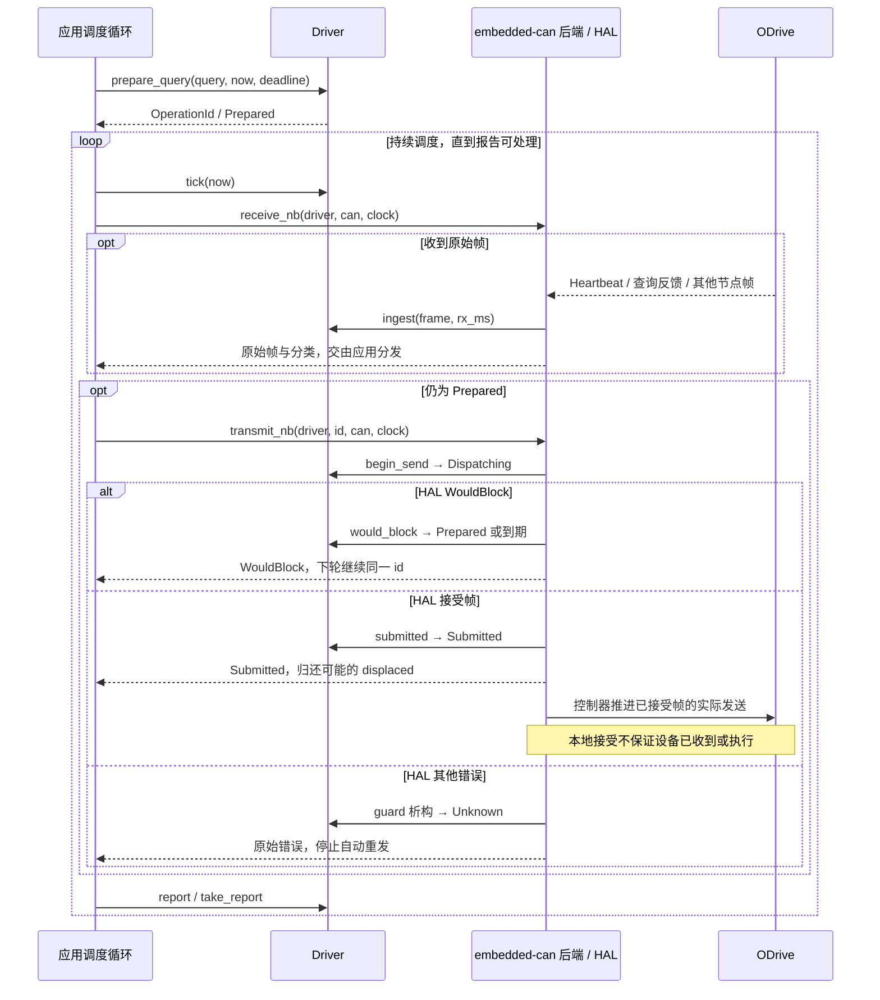
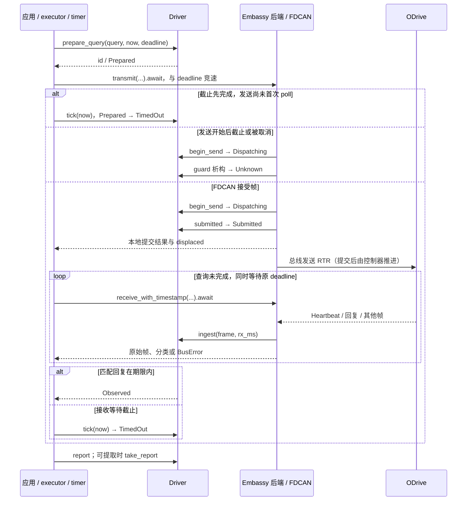
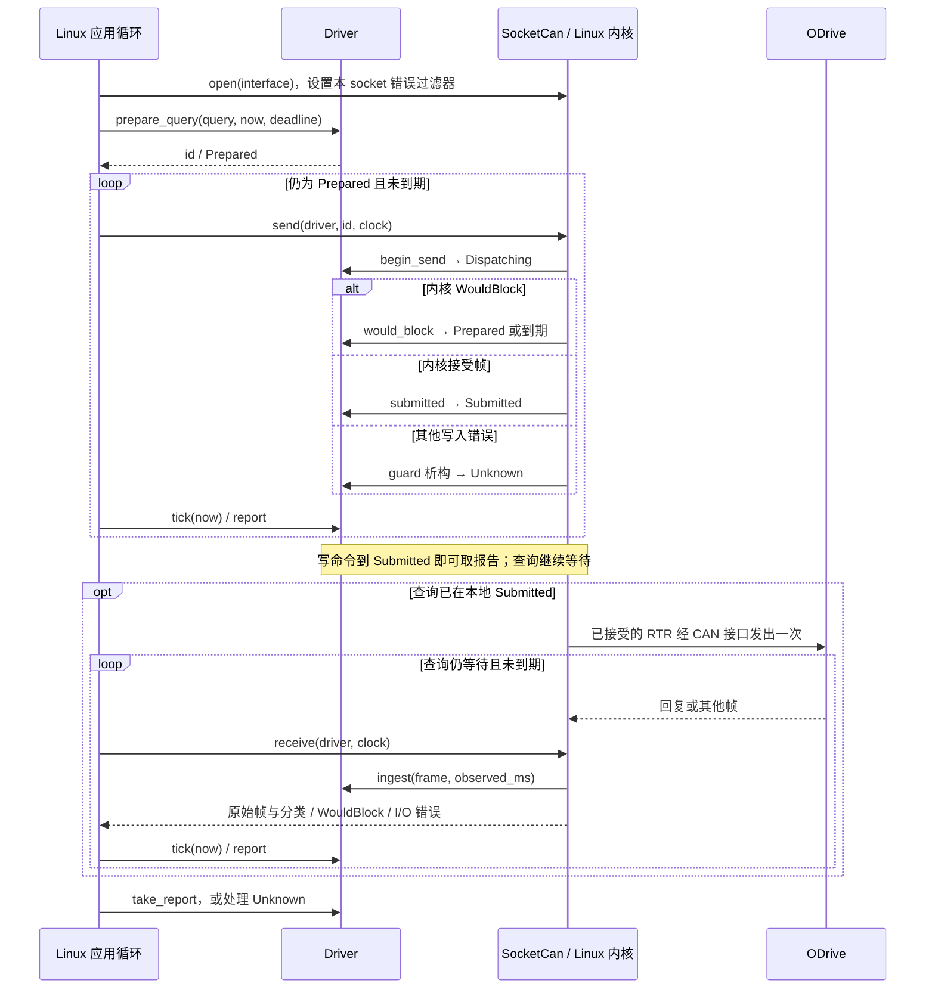

<!-- Copyright The odrive-can-driver Contributors -->
<!-- 说明安装、三个后端的用法与时序，以及操作结果和异常处理。 -->

# odrive-can-driver

[](https://github.com/MRNIU/odrive-can-driver/actions/workflows/ci.yml)
[](https://crates.io/crates/odrive_can_driver)
[](https://docs.rs/odrive_can_driver)
[](LICENSE)
[](https://blog.rust-lang.org/2025/02/20/Rust-1.85.0/)

`odrive_can_driver` 是 ODrive CANSimple 驱动库。共享 `Driver` 管理单节点的命令、查询、反馈缓存、操作身份、期限和发送结果；三个可选后端负责实际收发。默认 `no_std`、无动态分配，使用已发布的 `odrive-can-protocol 0.1.2` 编解码与帧适配。

## 安装

```toml
[dependencies]
odrive_can_driver = { version = "0.1.1", features = ["embedded-can"] }
```

按接入方式选择 feature；只使用共享状态机时可省略 `features`，默认是 `[]`。

| feature | 接入方式 | Rust 要求 | 使用入口 |
|---|---|---|---|
| `embedded-can` | 实现 `embedded-can 0.4` 的 HAL，blocking 或非阻塞轮询 | 1.85 | [轮询示例与时序](#embedded-can) |
| `embassy-stm32` | 已配置的 STM32 FDCAN，原生异步收发 | 固定依赖组合已验证 1.98.1 | [依赖配置、异步示例与时序](#embassy-stm32) |
| `socketcan` | Linux 非阻塞 SocketCAN，无异步运行时 | 1.89 | [命令行示例与时序](#socketcan) |

**Embassy 必须使用下文的 workspace patch**：registry `embassy-stm32 0.6.0` 存在 RTR DLC 8 发送缺陷；已验证的 Git revision 修复了它。Cargo 不会向消费方传递本库的 patch。

## 一次操作怎样完成

1. 为设备节点创建 `Driver::new(NodeId::new(node)?)`。
2. 用 `prepare_command` 或 `prepare_query` 准备操作，取得 `OperationId`。这一步只验证和编码，没有发送。
3. 调用对应后端的发送函数；它内部完成 `begin_send` 和发送结果记录。
4. 持续接收并分发帧，同时用 `tick(now_ms)` 推进期限。接收会更新缓存，匹配的查询反馈可使操作成为 `Observed`。
5. 用 `report(id)` 查看进展；终态后 `take_report(id)` 取走报告，再开始下一操作。`Unknown` 有额外处理要求，见下文。

一个 `Driver` 只有一个操作槽，**未取走的终态报告也占用它**。所有时刻以同一单调时钟的毫秒值表示，`deadline_ms` 是绝对期限。例如当前 `1000`、期限 `1100` 表示剩余 100 ms；反馈必须在提交后且严格早于期限才参与查询完成判断。

## 发心跳、读状态与保活

**Heartbeat 由 ODrive 周期发送，主机接收。** 当前协议没有 `Command::Heartbeat` 或 `Query::Heartbeat`；本库不伪造设备心跳，也不配置设备心跳周期。先在设备端配置周期，随后持续调用后端接收函数，读取缓存中的轴状态、完整错误位和接收时间：

```rust
use odrive_can_driver::{Driver, ResponseKind, protocol::{AxisState, Response}};

fn fresh_axis_state(driver: &Driver, now_ms: u64, max_age_ms: u64)
    -> Option<(AxisState, u32)>
{
    if !driver.cache().heartbeat_is_fresh(now_ms, max_age_ms) {
        return None;
    }
    match driver.cache().get(ResponseKind::Heartbeat)?.response {
        Response::Heartbeat { axis_state, axis_error } => Some((axis_state, axis_error)),
        _ => None,
    }
}
```

`None` 表示没有可用的新鲜状态，不能当作 Idle 或无错误。非零 `axis_error` 是设备错误位图；未知位也保留。`max_age_ms` 由应用根据设备发送周期和允许的延迟设置。

如果“发心跳”指**主机保活**，应用可以按自己的调度周期调用 `prepare_query(Query::VbusVoltage, now_ms, deadline_ms)`，再通过后端真正发出并处理报告。在支持的 v0.5.1 固件中，寻址到该轴的 CANSimple 帧（包含 RTR 查询）会喂 watchdog。因此查询也会延长 watchdog，不能把持续查询后的存活误认为控制任务仍健康。库不创建后台保活任务；查询周期和 watchdog 超时由应用明确配置，上一操作结束并取走报告后才准备下一次。

## 发指令、查询数据、清错误

下面的值直接来自 `odrive_can_driver::protocol`。写指令传给 `prepare_command`，读取请求传给 `prepare_query`，两者随后都使用同一个后端发送入口。

| 目的 | 传入值 | 如何确认后续状态 |
|---|---|---|
| 请求停止输出/Idle | `Command::SetAxisRequestedState { state: AxisState::IDLE }` | 继续接收，要求提交后新的 Heartbeat 显示 Idle；机械停止还需应用自己的反馈判据 |
| 请求闭环 | `Command::SetAxisRequestedState { state: AxisState::CLOSED_LOOP_CONTROL }` | 在应用许可、标定和目标已准备的前提下发送，再观察新的状态与错误 |
| 设置速度 | `Command::SetInputVel { velocity, torque_ff }` | 单位分别为 turn/s、N·m；读 `EncoderEstimates` 观察实际运动 |
| 设置位置 | `Command::SetInputPos { position, velocity_ff, torque_ff }` | position 为 turn；两个前馈是原始 `i16`，每计数分别为 0.001 turn/s、0.001 N·m |
| 设置转矩 | `Command::SetInputTorque { torque }` | 单位 N·m；不隐式切换控制模式 |
| 设置控制/输入模式 | `Command::SetControllerModes { control_mode, input_mode }` | 两个字段是固件定义的原始模式值，应用选择适用组合 |
| 清错误 | `Command::ClearErrors` | 观察新的 Heartbeat，并按需重新查询各子系统错误；故障原因仍存在时可能再次报错 |
| 急停故障请求 | `Command::Estop` | 观察新的设备错误/状态；它仍依赖通信，不能替代独立硬件停止通道 |
| 读轴状态/轴错误 | 接收 `Response::Heartbeat` | 用上面的缓存时效检查，不发送虚构的 Heartbeat RTR |
| 读位置/速度 | `Query::EncoderEstimates` | `Response::EncoderEstimates { position, velocity }` |
| 读电机/编码器错误 | `Query::MotorError` / `Query::EncoderError` | `Response::MotorError(bits)` / `Response::EncoderError(bits)` |
| 读母线电压/电流 | `Query::VbusVoltage` / `Query::Iq` | `Response::VbusVoltage(volts)` / `Response::Iq { setpoint, measured }` |

例如准备清错：

```rust
use odrive_can_driver::{Driver, OperationId, PrepareError, protocol::Command};

fn prepare_clear_errors(driver: &mut Driver, now_ms: u64, deadline_ms: u64)
    -> Result<OperationId, PrepareError>
{
    driver.prepare_command(Command::ClearErrors, now_ms, deadline_ms)
}
```

取得 `id` 后，分别调用 `embedded_can::transmit_nb` / `transmit_blocking`、`embassy::transmit(...).await` 或 `SocketCan::send`。完整发送、接收、期限和错误分支见[后端接入与时序](#后端接入与时序)。

**写命令的 `Submitted` 只表示后端接受了帧。** 取走该报告后仍应持续接收；需要确认 Idle 或清错效果时，比较后续 Heartbeat 的 `received_at_ms` 与报告的 `submitted_at_ms`，并检查目标状态/错误位。CANSimple 没有事务序号，Heartbeat 不是命令 ACK，查询的 `Observed` 也只表示在时间窗口内观察到同节点同类型反馈。

清错不会自动进入闭环；进入闭环不会自动设置安全目标；写零速度也不等于进入 Idle。这些步骤由应用根据设备模式、限值和保护策略显式安排。

## 异常处理

处理顺序是：**保留原始错误 → 查看 `report(id)` → 依据发送进展处理 → 满足条件后取走报告**。不要仅凭一个 I/O 错误判断“设备没收到”。

| 情况 | 含义与处理 |
|---|---|
| `PrepareError::Encode`、`DeadlineElapsed`、`ClockRollback` | 准备失败，没有此次发送。修正参数、绝对期限或时钟来源；不要跳过验证 |
| `PrepareError::Busy` | 上一操作或尚未取走的报告占用槽位。先处理它，不重建 Driver 来绕过未知状态 |
| TX `WouldBlock` | 明确未被后端接受，通常仍为 `Prepared`；继续接收和检查期限，稍后重试**同一 id** |
| RX 无帧 | embedded-can 返回 `Empty`，SocketCAN 返回 `WouldBlock`；不是设备故障，继续调度并 `tick` |
| `Failed` / `Cancelled` | 此操作已知未提交；取走报告后由应用决定是否发起新操作。`cancel` 仅适用于 `Prepared` |
| `TimedOut` | 看 `submitted_at_ms`：`None` 表示已知未提交，`Some` 表示查询已提交但反馈未及时观察到。取走报告，不据此认定设备未执行 |
| 发送 I/O 错误、发送 future 中途丢弃、接受后无法记录提交 | 可能是 `Unknown`。保留错误和报告，不自动重试；`take_report` 此时返回 `UnknownPending` |
| `Unknown` 的后续操作 | 先由应用确认底层不会再提交/迟到发送该帧，才调用 `acknowledge_unknown(id)`，随后 `take_report(id)`。这只释放追踪槽位，不证明设备未执行或已取消 |
| 接收错误、FD/RTR/扩展帧或无法解码的帧 | 处理后端错误与分类，并将原始帧交还总线分发方；接收失败不回滚已经提交的命令，也不自动清错或复位外设 |
| Heartbeat 过期、设备错误位非零 | 通信新鲜度与设备健康分开判断；保存完整错误位，再由应用决定停止、诊断、清错或恢复 |

blocking 接口没有可由本库保证的超时中断；嵌入式异步接口须由应用安排 timer/取消点。`tick` 只推进驱动记录，不会终止阻塞调用、撤销控制器队列或停止电机。SocketCAN 默认关闭错误通知，若需要总线错误帧，须通过 `bus.socket().set_error_filter(...)` 显式启用，见示例。

## 后端接入与时序

三个后端共用前述操作流程。以下源码展示实际收发、期限推进和错误分支；外设配置和调度由应用提供。

| 示例 | 用法 | 应用提供什么 |
|---|---|---|
| [embedded_can.rs](examples/embedded_can.rs) | 主循环反复调用 `poll_once` | 实现 `embedded_can::nb::Can` 的 HAL、单调时钟 |
| [embassy_stm32.rs](examples/embassy_stm32.rs) | 用 `exchange_until(...).await` 推进一次操作 | 已配置的 `Can`、executor、截止 future、时间戳映射与帧分发回调 |
| [socketcan.rs](examples/socketcan.rs) | Linux CLI，运行命令见下文 | 已启用的 SocketCAN 接口、节点号、操作参数 |

前两个是 `no_std` library 示例，可将其中的接入函数放入应用；SocketCAN 示例可直接运行。

### embedded-can

应用依赖：

```toml
[dependencies]
odrive_can_driver = { version = "0.1.1", features = ["embedded-can"] }
embedded-can = "0.4.1"
```

配置支持 `embedded-can 0.4` 的 HAL 后创建 `Driver`，用 `prepare_query(Query::VbusVoltage, now_ms, deadline_ms)` 取得 `id`。在自己的主循环或调度器中反复调用示例的 `poll_once`，每次从同一单调时钟重新采样：

- 每轮检查期限、接收至多一帧，并在仍为 `Prepared` 时尝试发送；有 RX 流量也不会跳过 TX 推进。
- 将接收结果中的原始帧交回共享总线分发器；发送结果中的 `displaced` 是被替换的旧 TX 帧，也须交回总线所有者。
- TX `WouldBlock` 表示尚未接受该帧，保留同一 `id` 到下一轮；其他 TX 错误必须结合报告判断，通常保留为 `Unknown`。
- 通过 `driver.take_report(id)` 提取终态。查询等待期间返回 `Pending`，`Unknown` 返回 `UnknownPending`；写命令本地 `Submitted` 已可提取。不要仅按状态名把所有 `Submitted` 都当作仍在等待。

把查询替换为 `prepare_command(Command::ClearErrors, now_ms, deadline_ms)` 或其他 [Command](#发指令查询数据清错误)，轮询方法不变。操作结束后仍要继续接收，才能维护 Heartbeat 时效与设备状态；没有活动操作时可直接调用 `receive_nb`。



HAL 只有 blocking 接口时，改用 `transmit_blocking`、`receive_blocking`。`embedded-can::blocking::Can` 没有标准的取消或超时中断能力：本库只能在调用前后检查时间，无法保证阻塞期间仍能推进期限。需要周期调度时优先使用 `nb` 入口。

### embassy-stm32

在**应用工作区根**配置依赖与固定修订：

```toml
[dependencies]
odrive_can_driver = { version = "0.1.1", features = ["embassy-stm32"] }
embassy-stm32 = { version = "0.6.0", features = ["stm32h723vg"] }

[patch.crates-io]
embassy-stm32 = { git = "https://github.com/embassy-rs/embassy", rev = "7b08a9c7d9a9fe620f4be25c4e7b86dd29f09f54" }
```

registry `embassy-stm32 0.6.0` 只在 DLC 为 0 时设置发送 RTR 位，而本协议查询使用 DLC 8；上述修订修复了它。Cargo 不向下游传递 library 的 patch，所以只启用 feature 不足以采用修复。该依赖组合使用 Rust 1.98.1；默认核心的 1.85 MSRV 不适用于这个可选后端。`stm32h723vg` 是芯片 feature 示例，应用应选择自己的 FDCAN 芯片。

应用初始化芯片、FDCAN 引脚、时钟与位速率，并拥有 executor。示例 `exchange_until` 对已有的 `Can` 和 `Driver` 推进一次操作：

1. 应用先用 `prepare_query(Query::VbusVoltage, now_ms, deadline_ms)` 或 `prepare_command(...)` 取得并保存 `id`，再传给 `exchange_until`；外层取消 future 后仍可使用这个 `id` 检查结果。
2. 同时提供单调 `now_ms`、在该操作绝对期限完成的 timer future、将 `FdEnvelope` 时间戳映射到该时钟域的函数，以及 `Handlers { tx, rx }` 两个结果回调。回调须处理被置换的 TX 帧和每个原始 RX 帧，不能吞掉其他设备的流量。
3. 示例将原生异步发送与截止 future 竞速；查询接受后，循环将接收与**同一个**截止 future 竞速，直到匹配回复或截止。Heartbeat 更新缓存，无关帧交给回调后继续等同一操作，绝不重新 prepare。
4. 写命令本地 `Submitted`、查询 `Observed` 或确定的超时等终态会取出报告；`Unknown` 只返回快照，继续占用操作槽，应用不能自动重发。接收 I/O 错误、时钟错误或外层取消后，也须用保存的 `id` 查看报告。

截止 future 必须对应准备操作时的 `deadline_ms`。发送尚未被首次 poll 时就截止，没有开始 I/O；若发送已开始再被取消，结果可能为 `Unknown`。RX 等待被取消不会撤销已提交的查询，随后仍需 `tick`。本例不保证设备取消，也不自动解除未知状态。

发送和接收都借用同一个 `Can`/`Driver`，应由统一总线任务顺序调度，不能把同一可变借用同时交给两个任务。



发送清错或状态指令时，用 `prepare_command` 得到 `id` 后调用 `embassy::transmit(&mut can, &mut driver, id, now_ms).await`，并使用同样的 deadline 处理。写命令的 `Submitted` 报告可立即取走；随后继续接收新的 Heartbeat，观察设备状态或错误变化。

### socketcan

仅支持 Linux；使用非阻塞 `socketcan 4`，无 Tokio 等运行时。

```toml
[dependencies]
odrive_can_driver = { version = "0.1.1", features = ["socketcan"] }
# 应用需要配置 socket 错误过滤器时直接使用此依赖。
socketcan = { version = "4", default-features = false }
```

先由系统配置并启用 CAN 接口及正确位速率，再运行仓库中的 CLI。以下 `can0` 和 node `1` 应替换为你的配置：

```sh
# 只接收设备 Heartbeat，输出轴状态和错误；不会发送主机心跳。
cargo run --features socketcan --example socketcan -- can0 1 heartbeat
# RTR 查询电压、编码器位置/速度、电机错误。
cargo run --features socketcan --example socketcan -- can0 1 vbus
cargo run --features socketcan --example socketcan -- can0 1 encoder
cargo run --features socketcan --example socketcan -- can0 1 motor-error
# 这两条会发送实际写命令；分别调用，不自动进入闭环。
cargo run --features socketcan --example socketcan -- can0 1 clear-errors
cargo run --features socketcan --example socketcan -- can0 1 idle
```

还支持 `state`（等同 `heartbeat`）、`encoder-error`、`velocity <turn/s> [torque_ff_Nm]`。速度参数由应用根据设备模式和许可选择；该命令只写目标，不进入闭环，也不在 CLI 退出时自动归零或 Idle。

CLI 每次只执行指定操作，等待窗口为 1 s。写命令以本地 `Submitted` 成功退出；查询必须为 `Observed`，心跳接收必须观察到设备 Heartbeat。超时、I/O 失败或 `Unknown` 为非零退出。需要确认清错/Idle 效果时，继续接收并检查新的 Heartbeat；不能用上一个进程的成功退出码代替设备反馈。

示例显式打开该 socket 的错误通知过滤器，输出原始错误分类；这不会修改整个 CAN 接口。它拥有独立描述符并记录收到的无关帧。共享应用应将 `receive` 返回的 `frame` 交给自己的统一分发器，也可使用 `receive_frame` 分类已经读出的帧。



`receive` 返回 `WouldBlock` 时等待下一轮，不能把它当作设备错误；`send` 返回 `WouldBlock` 才允许重试同一操作。其他发送错误可能已产生副作用，按报告处理。出队观察时间不是硬件线上采样时间，不能用它证明队列中的帧刚刚由设备产生。

## 共享总线与支持范围

调用方统一读取、分发和提交发送。后端返回无关帧与可能被置换的 TX 帧；共享总线应用须继续处理它们。`embedded-can` trait 只表达 Classic/RTR，FD 和底层错误信息应在原生 HAL 层分发；Embassy 与 SocketCAN 保留原生帧形态。库不清空 RX、不重配总线，也不重建共享外设。

协议支持仅限 `odrive-can-protocol 0.1.2` 核对的 **ODrive `fw-v0.5.1`** 和 **MKS ODrive Mini `ODriveMINI-fw-v0.5.1-20250326`**。固定源码依据见[协议库支持矩阵](https://github.com/MRNIU/odrive-can-protocol#readme)，不能据此推断其他固件兼容。

完整 API 合同见 [rustdoc](https://docs.rs/odrive_can_driver)，贡献说明见 [CONTRIBUTING.md](CONTRIBUTING.md)。本项目采用 [MIT License](LICENSE)。
