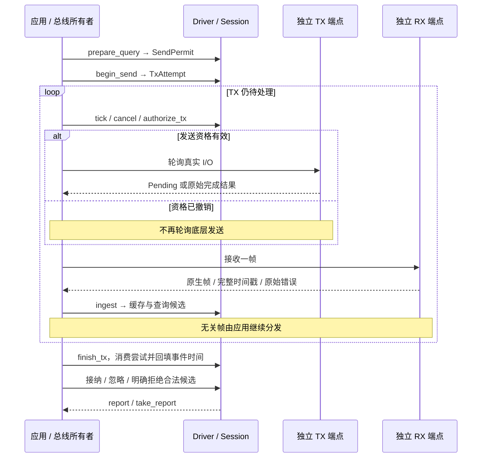
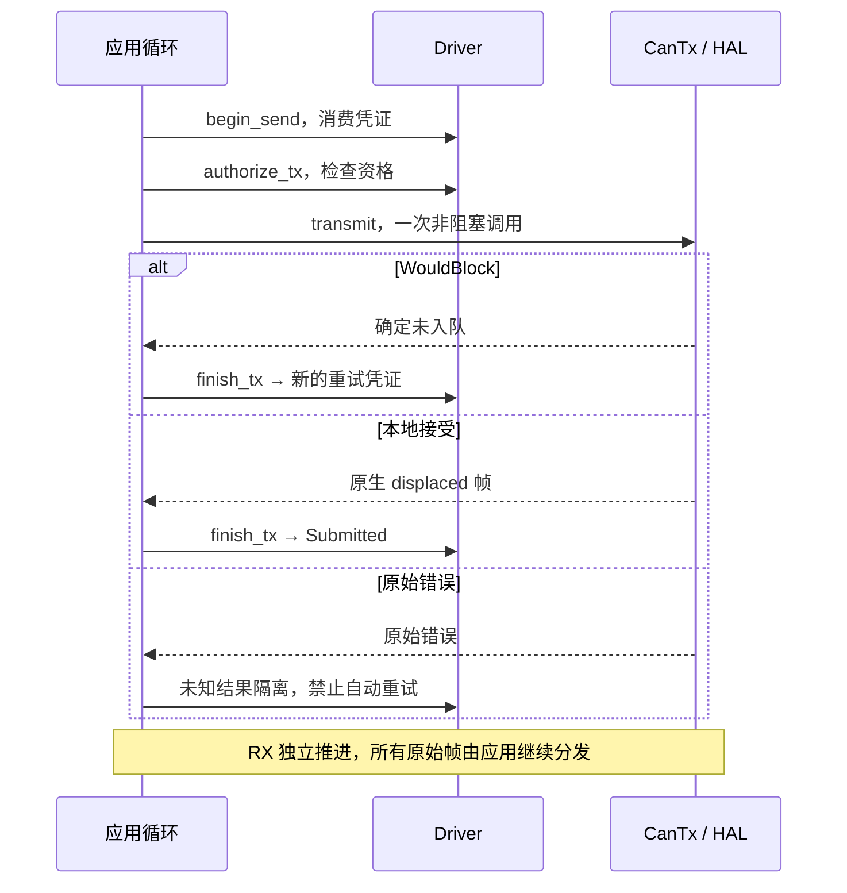
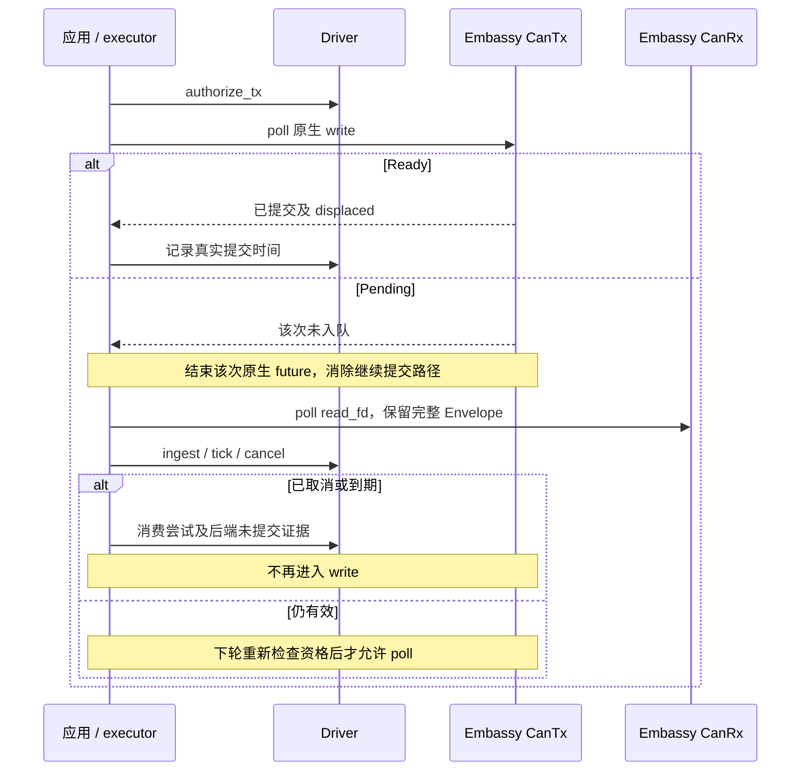

<!-- Copyright The odrive-can-driver Contributors -->
<!-- Copyright The odrive-can-protocol Contributors -->
<!-- 说明安装、三个后端的用法与时序，以及操作结果和异常处理。 -->

# odrive-can-driver

[](https://github.com/MRNIU/odrive-can-driver/actions/workflows/ci.yml)
[](https://crates.io/crates/odrive_can_driver)
[](https://docs.rs/odrive_can_driver)
[](LICENSE)
[](https://www.rust-lang.org/tools/install)

`odrive_can_driver` 是 ODrive CANSimple 库。它在同一个 crate 中提供硬件无关的 `protocol` 编解码层，以及管理单节点命令、查询、反馈缓存、操作身份、期限和发送结果的 `Driver`。三个可选后端负责实际收发。默认构建保持 `no_std`、无动态分配、无正常第三方依赖。

本版本要求 Rust 1.98.1（发布时的最新稳定版）。可选后端还需要各自的平台与外设条件，见下表。

## 安装

```toml
[dependencies]
odrive_can_driver = { version = "0.3.0", features = ["embedded-can"] }
```

按接入方式选择 feature；只使用协议编解码或共享状态机时可省略 `features`，默认是 `[]`。

| feature | 接入方式 | 平台与配置 | 使用入口 |
|---|---|---|---|
| `embedded-can` | 实现 `embedded-can 0.4` 的 HAL，非阻塞轮询 | 任何支持本 crate 的目标 | [轮询示例与时序](#embedded-can) |
| `embassy-stm32` | 已配置的 STM32 FDCAN，原生异步收发 | 应用选择 STM32、引脚、时钟和位速率 | [依赖配置、异步示例与时序](#embassy-stm32) |
| `socketcan` | Linux 非阻塞 SocketCAN，无异步运行时 | Linux 与 SocketCAN 接口 | [命令行示例与时序](#socketcan) |

**Embassy 必须使用下文的 workspace patch**：registry `embassy-stm32 0.6.0` 存在 RTR DLC 8 发送缺陷；已验证的 Git revision 修复了它。Cargo 不会向消费方传递本库的 patch。

## 只使用协议编解码

协议层在 `odrive_can_driver::protocol` 下，不访问 CAN 外设、不维护操作期限，也不决定控制策略。它可独立用于需要自己管理收发的应用：

```rust
use odrive_can_driver::protocol::{
    decode, encode, AxisState, Command, FrameId, FramePayload, FrameRef, Message, NodeId,
    Query, Response,
};

let node = NodeId::new(1).unwrap();
let velocity = encode(
    node,
    Message::Command(Command::SetInputVel {
        velocity: -2.5,
        torque_ff: 0.25,
    }),
)
.unwrap();
assert_eq!(velocity.id(), 0x02d);

let request = encode(node, Message::Request(Query::EncoderEstimates)).unwrap();
assert!(request.is_remote());
assert_eq!(request.dlc(), 8);

let heartbeat = [0x01, 0x00, 0x00, 0x80, 0x08, 0x00, 0x01, 0x00];
let frame = FrameRef {
    id: FrameId::Standard(0x021),
    payload: FramePayload::Data(&heartbeat),
};
assert_eq!(
    decode(node, frame).unwrap(),
    Some(Message::Response(Response::Heartbeat {
        axis_error: 0x8000_0001,
        axis_state: AxisState(0x0001_0008),
    }))
);
```

此示例只产生或解析协议帧；要发送 `velocity` 或 `request`，请使用下文的后端，或由应用自身提交帧。

## 从 `odrive-can-protocol` 迁移

`odrive-can-protocol` 的 `0.1.x` 是旧的独立 crate；其实现已内置到本 crate。将 Cargo 依赖改为 `odrive_can_driver = "0.3.0"`，并把导入从 `odrive_can_protocol::...` 改为 `odrive_can_driver::protocol::...`。例如：

```rust
// 旧：use odrive_can_protocol::{encode, Command, NodeId};
use odrive_can_driver::protocol::{encode, Command, NodeId};
```

旧独立 crate 的类型与本 crate 的内置类型不是同一 Rust 类型，即使名称和字段相同；同一个调用边界只能使用其中一套类型。迁移后删除旧依赖，不要同时混用两者。

## 操作、发送与查询接纳

`Driver` 只维护一个操作槽。应用拥有总线、发送端点、接收端点、时钟和调度；等待 I/O 不占用 `&mut Driver`。准备、真实 I/O、结果回填是独立步骤，三个后端使用同一个状态机。

1. 创建调用方持有的 `Session`，再创建 `Driver::new(&mut session, node)`。
2. `prepare_command` / `prepare_query` 返回不可复制的 `SendPermit`。保存 `permit.id()` 用于观察报告；准备不发送帧。
3. `begin_send(permit, now)` 一次消费凭证并生成 `TxAttempt`。后端每次轮询真实 I/O 前调用 `authorize_tx` 检查会话、操作、尝试、取消和期限。
4. 应用轮询 TX、读取和分发 RX、调用 `tick`。后端等待时不持有 Driver；已撤销的尝试不能在下一次轮询时调用真实 TX。
5. I/O 结束后用 `finish_tx` 一次消费尝试，记录提交或有证据的未提交。原始错误和被置换的 TX 帧归还总线所有者。
6. 查询反馈先进入缓存与候选项。应用以 `pending_response` 取得候选，再选择 `accept_response`、`ignore_response` 或 `reject_response`。
7. 用 `report(id)` 观察；终态用 `take_report(id)` 取走报告。未取走的报告和未解决的发送都占用唯一槽位。

`Session` 的借用生命周期把凭证绑定到实际 Driver 会话。操作和尝试还具有独立身份；不能拿旧尝试完成重试，也不能在旧凭证仍存活时重建同一 Session 的 Driver。不同 Session 的凭证不能交叉使用。不要通过丢弃 Driver 绕过设备端未知副作用。

### 时间合同

所有准备、轮询、提交、接收、期限、缓存和报告统一使用 `Instant`（微秒时间点），时间跨度使用 `Duration`。用 `Instant::from_micros(value)` / `Duration::from_micros(value)` 显式构造，`as_micros()` 读取原值。绝对期限不包含期限本身。

事件时间与处理时间分开：`occurred_at` / `received_at` 表示本地提交结果或接收事件，`processed_at` 表示状态机处理结果的时间。它们必须映射到同一个单调时钟域，但允许事件早于处理时间；迟到回填不等于时钟回退。后端在真实 I/O 返回后才采样结果时间。处理时钟回退会被拒绝，不能通过倒退时间延长发送资格。相同微秒值不能证明两个事件的因果顺序，因此查询要求 RX 严格晚于提交；等时刻帧仍保留在缓存中。

Embassy 返回完整 `FdEnvelope`，包括原生 `ts`；映射到 Driver 时间域时不得先转为毫秒。SocketCAN 可保留原始 `CanTimestamps`，由应用启用对应 socket 时间戳选项并映射时钟域。embedded-can 的标准 trait 不提供硬件时间戳；使用应用的出队观察时间时，它不是设备采样时间，也不能证明排队帧的新鲜度。

### 反馈缓存与完成是两件事

成功解码的同节点回复更新缓存，包括完整未知状态和错误位。缓存更新本身不完成查询。候选必须属于当前操作、同节点、同类型、提交后的时间窗口且严格早于期限；应用规则只能进一步限制，不能绕过这些条件。

| 应用选择 | 查询结果 | 缓存及提交事实 |
|---|---|---|
| `accept_response` | 合法候选使查询成为 `Observed` | 保存该反馈，保留提交时间 |
| `ignore_response` | 丢弃当前候选，继续等反馈或期限 | 不回滚响应缓存或提交事实 |
| `reject_response` | 明确拒绝并结束查询 | 保留已有提交时间；拒绝不等于未发送 |

查询反馈先于 TX 结果回填到达时，可先保存为候选；回填真实提交时间后再进行时间匹配和应用接纳。不会从旧缓存自动完成新查询。每个操作只保留最新事件时间的候选，更旧的迟到帧不会替换它；应用需要逐帧审查时，应在分发每一帧后立即处理候选。

`tick` 已报告查询超时时，事件时间仍在有效窗口内的延迟 RX/TX 可以继续参与接纳，直到应用 `take_report` 最终取走报告；取走之后不再追溯修改。应用取消或明确拒绝后不会被后续反馈恢复。应用负责旧帧隔离、来源连续性、接收队列水位等总线规则。CANSimple 没有请求序号，所以 `Observed` 只是符合规则的观察关联，不是因果 ACK。



## 取消、期限与未知结果

`tick` 和 `cancel` 撤销下一次发送资格；它们不会撤销已经入队的 CAN 帧，也不会停止电机。丢弃凭证或 future、普通取消、超时和原始 I/O 错误都不能单独证明未提交。

| 情况 | 后续处理 |
|---|---|
| 尚未开始 I/O 的准备操作 | 可取消；没有本次发送副作用 |
| 真实 I/O 返回 `WouldBlock` 且调用已结束 | 明确未入队，返回新的单次凭证，可由应用重试同一操作 |
| 固定后端证明 `Pending` 未入队，且原 future 已结束 | 可消费尝试，记录有证据的取消未提交 |
| 提交与取消竞争 | 保留真实提交事实，不能把已入队结果改写为未发送 |
| 期限到达但发送仍未解决 | 撤销后续发送资格并保持未知隔离，不能自动重试 |
| future / 凭证遗失或其他发送错误 | 结果按未知处理；先终止原发送任务并处理控制器队列，再显式解除未知隔离 |
| 已提交查询超时或被应用拒绝 | 查询结束，但已提交事实保留；不能推断设备没有处理请求 |
| 接收错误、FD/RTR/无关帧 | 归还原始结果给总线所有者，不改变已提交事实 |

发送结果回填只消费对应尝试一次。提交事实不会因回填处理晚于期限而消失；同一微秒的提交和取消按已发生的实际 I/O 处理，不凭时间值猜测“未发送”。若提交事件本身越过期限，报告保留 `submitted_at` 并进入 `Unknown`。丢失尝试后可用保存的 id 调用 `cancel` 撤销资格；应用确认原 TX 已结束并处理了控制器待发队列后，才可 `acknowledge_unknown`、`take_report`。确认后报告仍是未知，不构成未发送证明。Heartbeat 始终不是写命令 ACK。本版移除了无法在等待期间推进期限的 blocking 封装；应用使用非阻塞或 Embassy 轮询入口。

## 发心跳、读状态与保活

**Heartbeat 由 ODrive 周期发送，主机接收。** 当前协议没有 `Command::Heartbeat` 或 `Query::Heartbeat`。应用设置设备心跳周期，持续接收，并读取 `driver.cache()` 中的 `ResponseKind::Heartbeat`。新鲜度用同一微秒时钟和 `Duration` 判断；无新鲜样本不能当作 Idle 或无错误。

如果“发心跳”指主机保活，应用可以周期性准备并发送 `Query::VbusVoltage`。在支持的 v0.5.1 固件中，[节点匹配后、分派命令前就会喂 watchdog](https://github.com/odriverobotics/ODrive/blob/7831d795235e5ef8535e4b46621a0721b458ec8f/Firmware/communication/can_simple.cpp#L21-L38)，因此 RTR 查询也会延长 watchdog，不能据此认为控制任务仍健康；已锁存的 watchdog 错误也不会仅因再次喂狗而消失。库不创建后台保活任务；查询周期和 watchdog 超时由应用明确配置。

## 发指令、查询数据、清错误

写指令传给 `prepare_command`，读取请求传给 `prepare_query`，随后使用对应后端推进凭证：

| 目的 | 传入值 | 如何确认后续状态 |
|---|---|---|
| 请求停止输出/Idle | `Command::SetAxisRequestedState { state: AxisState::IDLE }` | 继续接收，要求提交后新的 Heartbeat 显示 Idle；机械停止还需应用自己的反馈判据 |
| 请求闭环 | `Command::SetAxisRequestedState { state: AxisState::CLOSED_LOOP_CONTROL }` | 在应用许可、标定和目标已准备的前提下发送，再观察新的状态与错误 |
| 设置速度 | `Command::SetInputVel { velocity, torque_ff }` | 单位分别为 turn/s、N·m；读 `EncoderEstimates` 观察实际运动 |
| 设置位置 | `Command::SetInputPos { position, velocity_ff, torque_ff }` | position 为 turn；两个前馈是原始 `i16`，每计数分别为 0.001 turn/s、0.001 N·m |
| 设置转矩 | `Command::SetInputTorque { torque }` | 单位 N·m；不隐式切换控制模式 |
| 设置控制/输入模式 | `Command::SetControllerModes { control_mode, input_mode }` | 两个字段是固件定义的原始模式值，应用选择适用组合 |
| 清错误 | `Command::ClearErrors` | 观察新的 Heartbeat，并按需重新查询各子系统错误；故障原因仍存在时可能再次报错 |
| 急停故障请求 | `Command::Estop` | 观察新的设备错误/状态；它仍依赖通信，不能替代独立硬件停止通道 |
| 读轴状态/轴错误 | 接收 `Response::Heartbeat` | 用上面的缓存时效检查，不发送虚构的 Heartbeat RTR |
| 读位置/速度 | `Query::EncoderEstimates` | `Response::EncoderEstimates { position, velocity }` |
| 读电机/编码器错误 | `Query::MotorError` / `Query::EncoderError` | `Response::MotorError(bits)` / `Response::EncoderError(bits)` |
| 读母线电压/电流 | `Query::VbusVoltage` / `Query::Iq` | `Response::VbusVoltage(volts)` / `Response::Iq { setpoint, measured }` |

**写命令的 `Submitted` 只表示后端接受了帧。** 清错、闭环、目标设置和停止由应用显式安排。需要确认清错或 Idle 效果时，持续接收新的 Heartbeat，比较它的接收时间与提交时间，并检查状态和错误。机械停止仍需应用自己的反馈判据。

## 后端接入与时序

| 示例 | 应用提供什么 | 等待边界 |
|---|---|---|
| [embedded_can.rs](examples/embedded_can.rs) | 单独的 `CanTx` / `CanRx` 端点、单调时钟及主循环 | 每次非阻塞调用的真实 `WouldBlock` |
| [embassy_stm32.rs](examples/embassy_stm32.rs) | 已配置的 FDCAN `CanTx` / `CanRx`、executor、timer、时间映射与分发回调 | 固定 Embassy `CanTx::write` 的真实 `Pending` |
| [socketcan.rs](examples/socketcan.rs) | 已启用的 Linux CAN 接口、节点和显式操作 | 非阻塞 socket 调用的真实 `WouldBlock` |

前两个是 `no_std` library 示例；SocketCAN 是可运行 CLI。库不清空 RX、不重配或重建外设。

### embedded-can

```toml
[dependencies]
odrive_can_driver = { version = "0.3.0", features = ["embedded-can"] }
embedded-can = "0.4.1"
```

本库的 `embedded_can::CanTx` / `CanRx` 支持分离端点；原来的 `embedded_can::nb::Can` 也通过适配接入。应用在每轮先推进时钟，处理 RX，再推进 TX；有持续 RX 时也要公平推进发送与期限。协议适配保留原生 Classic/RTR 帧、原始错误和 `displaced` 置换帧。

`embedded-can 0.4` trait 无法表达 FD 和硬件接收时间戳，拥有这些信息的 HAL 应用须在原生层分发，再把协议视图及完整时间送入 Driver，不能在转换时丢失原始数据。旧的 `transmit_blocking` / `receive_blocking` 封装已移除，只有 blocking HAL 的应用需自行安排同步 I/O 并遵守凭证及结果回填合同。



### embassy-stm32

在**应用工作区根**配置依赖与固定修订（Cargo 不向下游传递 library 的 patch）：

```toml
[dependencies]
odrive_can_driver = { version = "0.3.0", features = ["embassy-stm32"] }
embassy-stm32 = { version = "0.6.0", features = ["stm32h723vg"] }

[patch.crates-io]
embassy-stm32 = { git = "https://github.com/embassy-rs/embassy", rev = "7b08a9c7d9a9fe620f4be25c4e7b86dd29f09f54" }
```

registry `embassy-stm32 0.6.0` 的 RTR DLC 8 发送缺陷由上述修订修复。取消证据同样仅针对这个固定修订的**非缓冲** `CanTx::write`：[`TxMode::write_generic`](https://github.com/embassy-rs/embassy/blob/7b08a9c7d9a9fe620f4be25c4e7b86dd29f09f54/embassy-stm32/src/can/fdcan.rs#L984-L999) 在一次 poll 内同步调用寄存器发送，入队成功直接 `Ready`，只有 `WouldBlock` 才 `Pending`。[寄存器层的两个 `WouldBlock` 分支](https://github.com/embassy-rs/embassy/blob/7b08a9c7d9a9fe620f4be25c4e7b86dd29f09f54/embassy-stm32/src/can/fd/peripheral.rs#L227-L259) 都发生在写入新帧之前；成功置换旧帧则通过 `Ready` 返回该帧。该 future 结束后没有后台重试提交路径。不能将这个结论推广到 buffered CAN、其他 HAL 或其他 Embassy revision。

应用通过 `Can::split` 获取 `CanTx` / `CanRx`。TX 每次 poll 前经过 Driver 门禁；RX 保留完整 `FdEnvelope`，包括 Classic/FD/RTR 标志和原生时间戳。启用 Embassy `time`（通常由应用的 `time-driver-*` 启用）时，`ts` 是 Embassy `Instant`，可用 `as_micros()` 映射；未启用时是原生 16-bit 控制器时间戳，应用须处理其时钟域与回绕，不能直接当作 Driver 绝对时间。TX 等待期间应用照常接收、推进期限及响应取消。示例展示同一个调度循环中的这些步骤；库不另建任务、不加内部锁。



### socketcan

仅支持 Linux；使用非阻塞 `socketcan 4`，无异步运行时。接口与位速率由系统先配置。以下 `can0` 和 node `1` 应替换为你的配置：

```sh
cargo run --features socketcan --example socketcan -- can0 1 heartbeat
cargo run --features socketcan --example socketcan -- can0 1 vbus
cargo run --features socketcan --example socketcan -- can0 1 encoder
cargo run --features socketcan --example socketcan -- can0 1 motor-error
cargo run --features socketcan --example socketcan -- can0 1 clear-errors
cargo run --features socketcan --example socketcan -- can0 1 idle
```

还支持 `state`、`encoder-error`、`velocity <turn/s> [torque_ff_Nm]`。速度命令只写目标，不进入闭环，也不在 CLI 退出时自动归零或 Idle。CLI 每次只执行指定操作，窗口 1 s；写命令以本地 `Submitted` 成功退出，查询需应用接纳后 `Observed`。超时、I/O 失败或 `Unknown` 非零退出。

本示例启用其 socket 的错误过滤器；原始 Classic、RTR、FD 和错误通知均保留。共享应用应统一读取和分发，不能让多个消费者争抢同一个接收队列。发送成功是内核接受；只有 `WouldBlock` 证明该次未提交，其他错误保留未知结果。

## 从 0.2 Driver API 迁移

这是 Driver 公共接口的破坏性调整，协议命令、编码和固件支持范围不变；不保留第二套旧状态机。

| 旧接口 / 行为 | 新接口 / 行为 |
|---|---|
| `Driver::new(node)` | 应用持有 `Session`；`Driver::new(&mut session, node)` |
| `prepare_*` 返回 `OperationId` | 返回一次消费的 `SendPermit`；用 `permit.id()` 保存观察标识 |
| `SendAttempt` 长期借用 Driver | `TxAttempt` 独立持有身份；每次实际发送短暂检查 Driver 门禁 |
| `*_ms: u64` | 明确的 `Instant` / `Duration` 微秒类型；字段移除 `_ms` |
| 后端内部从 id 查帧并开始 I/O | 传递线性凭证 / 尝试，分开授权、真实 I/O 与结果回填 |
| `ingest` 自动完成匹配查询 | `ingest` 缓存并生成候选；应用明确接纳、忽略或拒绝 |
| 丢弃发送 guard 后处理未知 | 保留当前尝试与原始结果；停止旧 I/O 后按证据处置，不能自动重试 |

## 协议支持范围

协议 API 位于 `odrive_can_driver::protocol::fw_v0_5_1`，crate 的 `protocol` 模块同时重导出主要类型与 `encode`、`decode`。编码只产生 11-bit Classic CAN 帧；多字节字段为 little-endian，浮点字段为 IEEE 754 binary32。

| 固件 | 协议模块 | 状态 | 固定源码依据 |
|---|---|---|---|
| ODrive `fw-v0.5.1` | `fw_v0_5_1` | 已支持 | [ODrive 固件基线 `7831d795`](https://github.com/odriverobotics/ODrive/tree/7831d795235e5ef8535e4b46621a0721b458ec8f) |
| MKS ODrive Mini `ODriveMINI-fw-v0.5.1-20250326` | `fw_v0_5_1` | 已支持，同一 CANSimple 布局 | [固定 MKS 固件包](https://github.com/makerbase-motor/MKS-ODrive/blob/e15782976ae93d42b1f0648ceec96503141a343b/Firmware/MKS%20ODrive%20MINI/ODriveMINI-fw-v0.5.1-20250326.rar) |

MKS 结论仅覆盖表中的固定源码包：其中 CANSimple 源码与上述 ODrive 基线一致，因此不需要 MKS 专用 feature 或转换层。其他 ODrive 或 MKS 固件版本必须先核对对应源码，不能由本表推断兼容性。

完整 API 合同见 [rustdoc](https://docs.rs/odrive_can_driver)，贡献说明见 [CONTRIBUTING.md](CONTRIBUTING.md)。本项目采用 [MIT License](LICENSE)。
