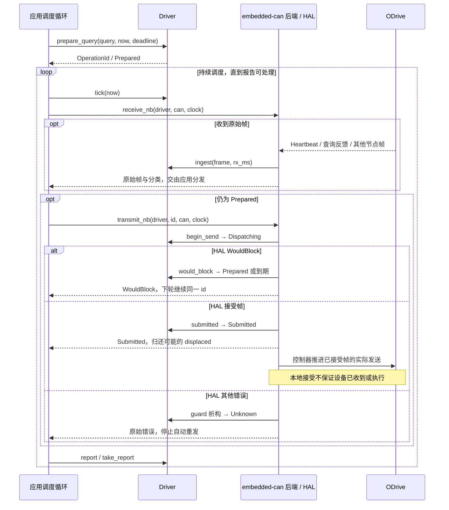
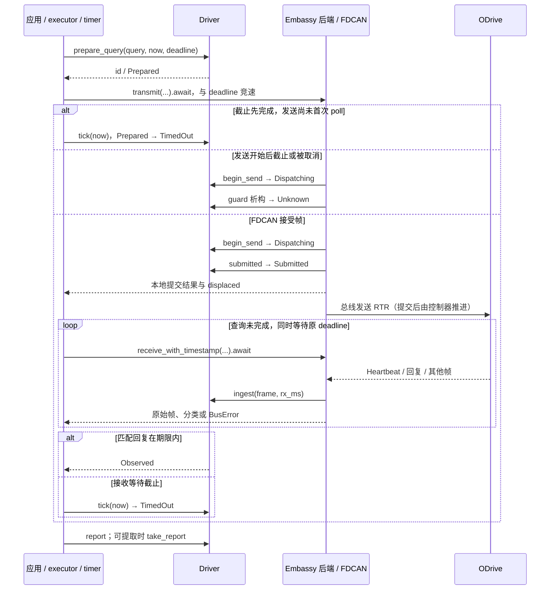
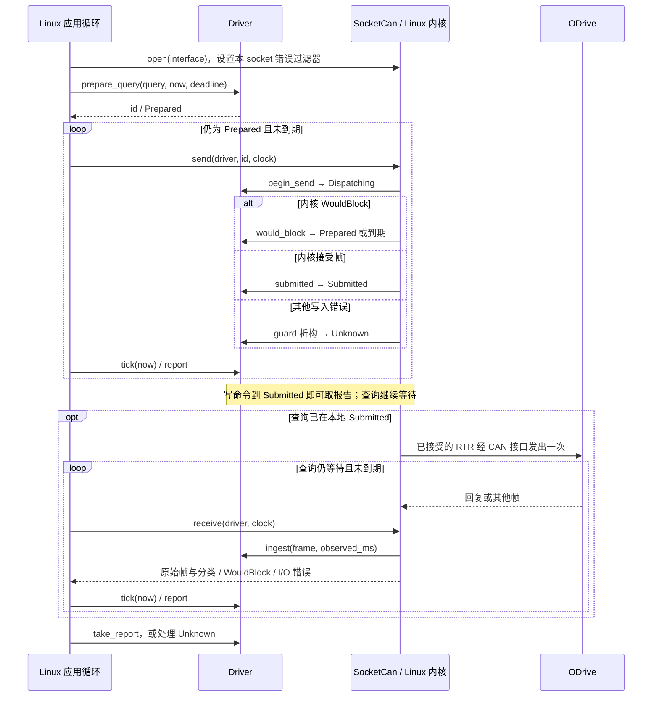

<!-- Copyright The odrive-can-driver Contributors -->
<!-- 展示三个后端的实际接入、收发时序和运行方式；通用操作语义由根 README 维护。 -->

# 三个后端怎么用

三个后端共用 `Driver`。先在应用中配置节点、CAN 接口和单调毫秒时钟，再准备命令或查询；后端负责实际 I/O 和提交记录。具体指令、Heartbeat、watchdog 与异常处理见 [README](../README.md#发心跳读状态与保活)。

| 示例 | 形式 | 应用提供什么 |
|---|---|---|
| [embedded_can.rs](embedded_can.rs) | 可编译的 `no_std` 轮询接入函数 | 实现 `embedded_can::nb::Can` 的 HAL、时钟和调度循环 |
| [embassy_stm32.rs](embassy_stm32.rs) | 可编译的 `no_std` 异步查询函数 | 已配置的 `Can`、executor、截止 future、时间戳映射与接收分发函数 |
| [socketcan.rs](socketcan.rs) | Linux 可运行 CLI | 已配置并启用的 SocketCAN 接口、节点号、操作参数 |

前两个以 `crate-type = ["lib"]` 编译，便于把接入函数放入应用；它们不伪造外设初始化，也不带空 `main`。需要完整 STM32H723 固件时，使用 [h723-bench](h723-bench/README.md)。

## embedded-can

应用依赖：

```toml
[dependencies]
odrive_can_driver = { version = "0.1.0", features = ["embedded-can"] }
embedded-can = "0.4.1"
```

配置支持 `embedded-can 0.4` 的 HAL 后创建 `Driver`，用 `prepare_query(Query::VbusVoltage, now_ms, deadline_ms)` 取得 `id`。在自己的主循环或调度器中反复调用示例的 `poll_once`，每次从同一单调时钟重新采样：

- 每轮检查期限、接收至多一帧，并在仍为 `Prepared` 时尝试发送；有 RX 流量也不会跳过 TX 推进。
- 将接收结果中的原始帧交回共享总线分发器；发送结果中的 `displaced` 是被替换的旧 TX 帧，也须交回总线所有者。
- TX `WouldBlock` 表示尚未接受该帧，保留同一 `id` 到下一轮；其他 TX 错误必须结合报告判断，通常保留为 `Unknown`。
- 通过 `driver.take_report(id)` 提取终态。查询等待期间返回 `Pending`，`Unknown` 返回 `UnknownPending`；写命令本地 `Submitted` 已可提取。不要仅按状态名把所有 `Submitted` 都当作仍在等待。

把查询替换为 `prepare_command(Command::ClearErrors, now_ms, deadline_ms)` 或其他 [Command](../README.md#发指令查询数据清错误)，轮询方法不变。操作结束后仍要继续接收，才能维护 Heartbeat 时效与设备状态；没有活动操作时可直接调用 `receive_nb`。



HAL 只有 blocking 接口时，改用 `transmit_blocking`、`receive_blocking`。`embedded-can::blocking::Can` 没有标准的取消或超时中断能力：本库只能在调用前后检查时间，无法保证阻塞期间仍能推进期限。需要周期调度时优先使用 `nb` 入口。

在仓库中检查接入代码（不连接硬件）：

```sh
cargo check --locked --example embedded_can --features embedded-can \
  --target thumbv7em-none-eabihf
```

## embassy-stm32

在**应用工作区根**配置依赖与固定修订：

```toml
[dependencies]
odrive_can_driver = { version = "0.1.0", features = ["embassy-stm32"] }
embassy-stm32 = { version = "0.6.0", features = ["stm32h723vg"] }

[patch.crates-io]
embassy-stm32 = { git = "https://github.com/embassy-rs/embassy", rev = "7b08a9c7d9a9fe620f4be25c4e7b86dd29f09f54" }
embassy-executor = { git = "https://github.com/embassy-rs/embassy", rev = "7b08a9c7d9a9fe620f4be25c4e7b86dd29f09f54" }
embassy-time = { git = "https://github.com/embassy-rs/embassy", rev = "7b08a9c7d9a9fe620f4be25c4e7b86dd29f09f54" }
embassy-sync = { git = "https://github.com/embassy-rs/embassy", rev = "7b08a9c7d9a9fe620f4be25c4e7b86dd29f09f54" }
embassy-usb = { git = "https://github.com/embassy-rs/embassy", rev = "7b08a9c7d9a9fe620f4be25c4e7b86dd29f09f54" }
embassy-futures = { git = "https://github.com/embassy-rs/embassy", rev = "7b08a9c7d9a9fe620f4be25c4e7b86dd29f09f54" }
```

registry `embassy-stm32 0.6.0` 只在 DLC 为 0 时设置发送 RTR 位，而本协议查询使用 DLC 8；上述修订修复了它。Cargo 不向下游传递 library 的 patch，所以只启用 feature 不足以采用修复。该 H723 组合已验证 Rust 1.98.1；Rust 1.89 在传递依赖 `xarxa-driver::cfg_select!` 处失败，未为该组合声明精确 MSRV。

应用初始化芯片、FDCAN 引脚、时钟与位速率，并拥有 executor。示例 `exchange_until` 对已有的 `Can` 和 `Driver` 推进一次操作：

1. 应用先用 `prepare_query(Query::VbusVoltage, now_ms, deadline_ms)` 或 `prepare_command(...)` 取得并保存 `id`，再传给 `exchange_until`；外层取消 future 后仍可使用这个 `id` 检查结果。
2. 同时提供单调 `now_ms`、在该操作绝对期限完成的 timer future、将 `FdEnvelope` 时间戳映射到该时钟域的函数，以及 `Handlers { tx, rx }` 两个结果回调。回调须处理被置换的 TX 帧和每个原始 RX 帧，不能吞掉其他设备的流量。
3. 示例将原生异步发送与截止 future 竞速；查询接受后，循环将接收与**同一个**截止 future 竞速，直到匹配回复或截止。Heartbeat 更新缓存，无关帧交给回调后继续等同一操作，绝不重新 prepare。
4. 写命令本地 `Submitted`、查询 `Observed` 或确定的超时等终态会取出报告；`Unknown` 只返回快照，继续占用操作槽，应用不能自动重发。接收 I/O 错误、时钟错误或外层取消后，也须用保存的 `id` 查看报告。

截止 future 必须对应准备操作时的 `deadline_ms`。发送尚未被首次 poll 时就截止，没有开始 I/O；若发送已开始再被取消，结果可能为 `Unknown`。RX 等待被取消不会撤销已提交的查询，随后仍需 `tick`。本例不保证设备取消，也不自动解除未知状态。

发送和接收都借用同一个 `Can`/`Driver`，应由统一总线任务顺序调度，不能把同一可变借用同时交给两个任务。



发送清错或状态指令时，用 `prepare_command` 得到 `id` 后调用 `embassy::transmit(&mut can, &mut driver, id, now_ms).await`，并使用同样的 deadline 处理。写命令的 `Submitted` 报告可立即取走；随后继续接收新的 Heartbeat，观察设备状态或错误变化。

检查接入函数与完整固件：

```sh
cargo +1.98.1 check --locked --example embassy_stm32 \
  --target thumbv7em-none-eabihf \
  --features embassy-stm32,embassy-stm32/stm32h723vg
(cd examples/h723-bench && cargo +1.98.1 build --locked --release)
```

完整固件从自己的目录构建，以加载其 `.cargo/config.toml` 链接配置；接线和运行方式见 [H723 说明](h723-bench/README.md)。

## socketcan

仅支持 Linux；使用非阻塞 `socketcan 4`，无 Tokio 等运行时。

```toml
[dependencies]
odrive_can_driver = { version = "0.1.0", features = ["socketcan"] }
# 应用需要配置 socket 错误过滤器时直接使用此依赖。
socketcan = { version = "4", default-features = false }
```

先由系统配置并启用 CAN 接口及正确位速率，再运行仓库中的 CLI。以下 `can0` 和 node `1` 应替换为你的配置：

```sh
# 只接收设备 Heartbeat，输出轴状态和错误；不会发送主机心跳。
cargo run --features socketcan --example socketcan -- can0 1 heartbeat
# RTR 查询电压、编码器位置/速度、电机错误。
cargo run --features socketcan --example socketcan -- can0 1 vbus
cargo run --features socketcan --example socketcan -- can0 1 encoder
cargo run --features socketcan --example socketcan -- can0 1 motor-error
# 这两条会发送实际写命令；分别调用，不自动进入闭环。
cargo run --features socketcan --example socketcan -- can0 1 clear-errors
cargo run --features socketcan --example socketcan -- can0 1 idle
```

还支持 `state`（等同 `heartbeat`）、`encoder-error`、`velocity <turn/s> [torque_ff_Nm]`。速度参数由应用根据设备模式和许可选择；该命令只写目标，不进入闭环，也不在 CLI 退出时自动归零或 Idle。

CLI 每次只执行指定操作，等待窗口为 1 s。写命令以本地 `Submitted` 成功退出；查询必须为 `Observed`，心跳接收必须观察到设备 Heartbeat。超时、I/O 失败或 `Unknown` 为非零退出。需要确认清错/Idle 效果时，继续接收并检查新的 Heartbeat；不能用上一个进程的成功退出码代替设备反馈。

示例显式打开该 socket 的错误通知过滤器，输出原始错误分类；这不会修改整个 CAN 接口。它拥有独立描述符并记录收到的无关帧。共享应用应将 `receive` 返回的 `frame` 交给自己的统一分发器，也可使用 `receive_frame` 分类已经读出的帧。



`receive` 返回 `WouldBlock` 时等待下一轮，不能把它当作设备错误；`send` 返回 `WouldBlock` 才允许重试同一操作。其他发送错误可能已产生副作用，按报告处理。出队观察时间不是硬件线上采样时间，不能用它证明队列中的帧刚刚由设备产生。

检查示例及 Linux 套接字集成（vcan 没有物理设备）：

```sh
cargo check --locked --features socketcan --example socketcan
sudo modprobe vcan
sudo ip link add dev odrive-vcan type vcan
sudo ip link set odrive-vcan up
cargo test --locked --features socketcan --test socketcan -- --ignored
sudo ip link delete odrive-vcan
```

vcan 集成测试会创建受控对端；单独对空 vcan 运行 `vbus` 应超时。这些结果只证明软件路径，不能证明物理总线、设备运动或 Bus-Off。
